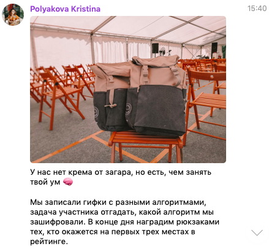
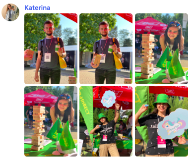
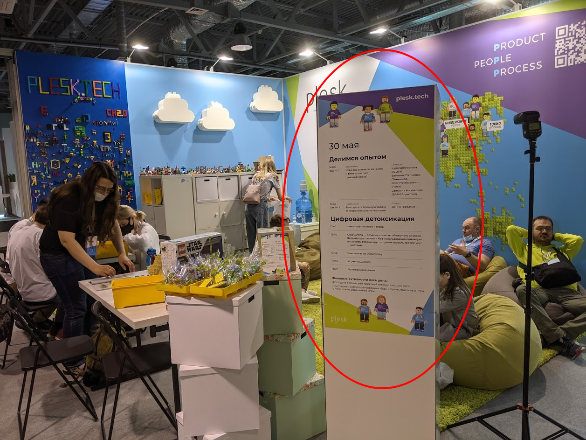

# Подготовка активностей на стенде

## Организация стенда

Наш опыт работы с партнерами и организации стендов говорит, что для подготовки стенда вам потребуются 3-5 человек на следующие роли:

- Подготовка дизайна и концепции стенда;
- Проработка концепции мерча и его дизайна;
- Организация производства и закупки оборудования для стенда (поиск подрядчиков, взаимодействие с подрядчиками, заключение договора, контроль качества);
- Организация производства мерча (поиск подрядчиков, взаимодействие с подрядчиками, заключение договора, контроль качества);
- Проработка технических активностей на стенде.

## Персонал стенда

По многочисленным отзывам участников, важно, чтобы **на стенде присутствовали технические специалисты**, занятые в актуальных и известных проектах/продуктах компании (участникам важно пообщаться с людьми, **погруженными в тематику, услышать экспертное мнение**).

Обычно на стенде также работают HR-, PR-специалисты, маркетологи (их наличие зависит от целей компании на конференции).

Рекомендации, которые помогут улучшить стенд:

- Если персонал стенда одет в фирменную одежду компании, это выделяет среди всех участников людей, с которыми можно поговорить о компании;
- Находиться на стенде весь день — довольно сложная работа. Если можете организовать активности так, чтобы персонал на стенде мог сменяться в течение дня, то всем будет легче общаться с аудиторией;

## Цели стенда

Стенд компании на конференции может преследовать разные цели, но мы советуем сконцентрироваться в проработке концепции на следующих вещах:

- Какие ценности компании вы хотите показать на конференции, какой образ должен сложиться о компании у участников;
- Какая главная отличительная особенность, которая будет привлекать людей: сложные технологические вызовы, культура компании, стек, заказчики и предметная область. Чем запомнится компания;
- Какая аудитория для вас наиболее интересна — это поможет подготовить активности, которые будут с одной стороны привлекать нужную аудиторию, а с другой не распылять внимание.

## Зачем вообще делать активности

Чтобы привлечь, заинтересовать и удержать участников на стенде. Чтобы ваши технические специалисты могли начать разговор, чтобы заинтересовать культурой компании.

Какие активности мы встречали:

- Общие задачи на сообразительность
- Тематические задачи по стекам технологий
- Задачи на "Погуглить"
- Головоломки, конструкторы
- Физические активности (кикер, аэрохоккей, дартс (пластиковый), турник и многое другое)
- VR
- Кодинг, чемпионаты по кодингу, кодинг "вслепую"
- Настольные игры
- Раскраски
- Фотозоны
- Игровые автоматы
- Массажные кресла
- Квесты

## Анонс активностей

Организаторы разместят описание того, что будет на стендах компаний.

1. **До конференции** в соцсетях конференции. Для этого нужно предоставить описание активности до начала конференции

2. **Во время конференции** в телеграм-канале конференции.

3. Кроме того, рекомендуем самим закидывать анонсы и фото своего стенда в телеграм-чат конференции, например: 

4. Можно расположить расписание активонстей прямо на стенде — на заднике стенда, на отдельной стойке или на информационной стойке стенда 

**← [К оглавлению](../README.md)**