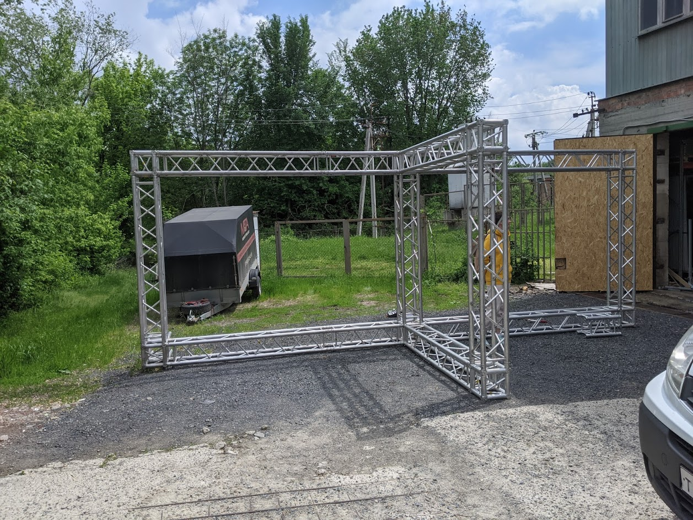
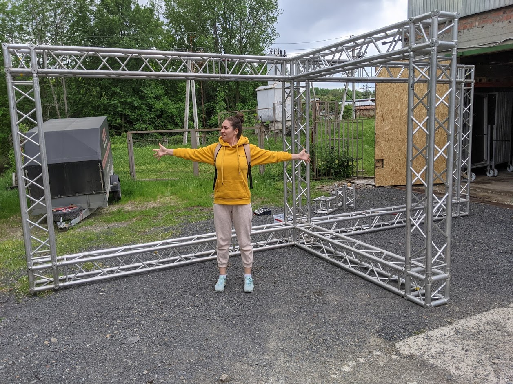
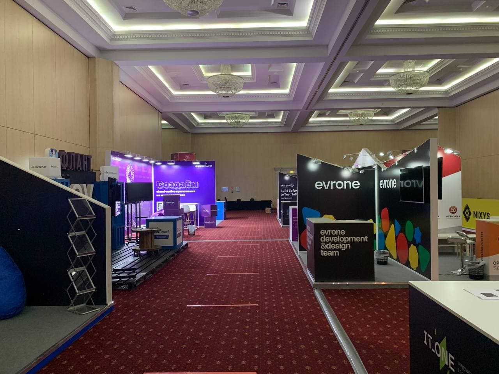
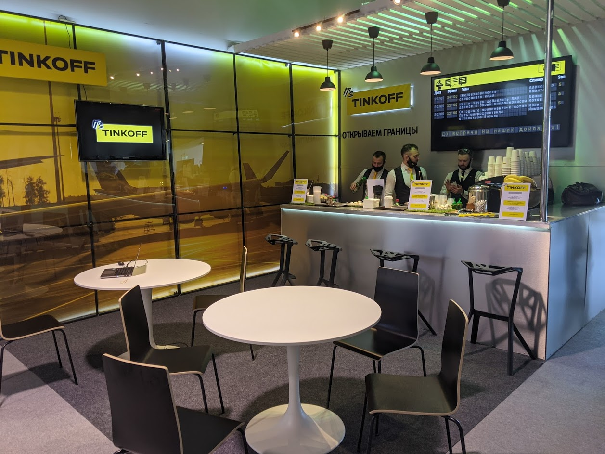
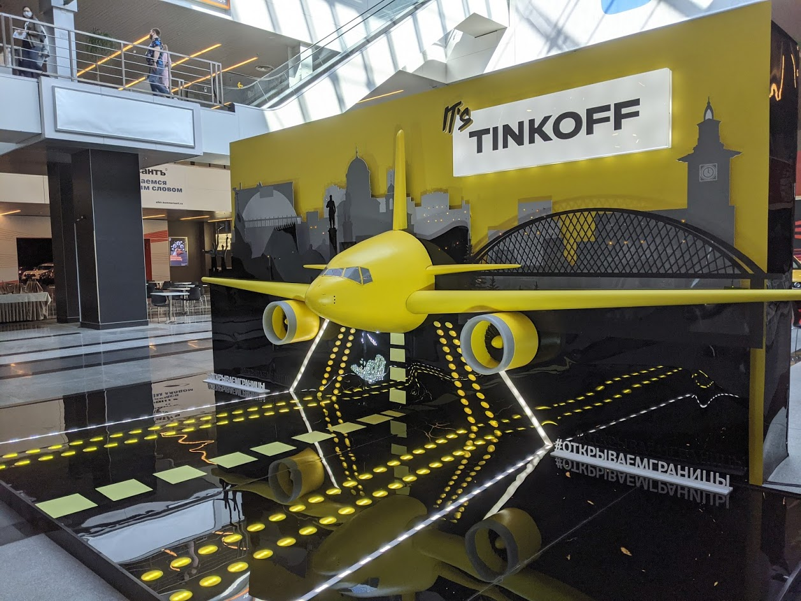
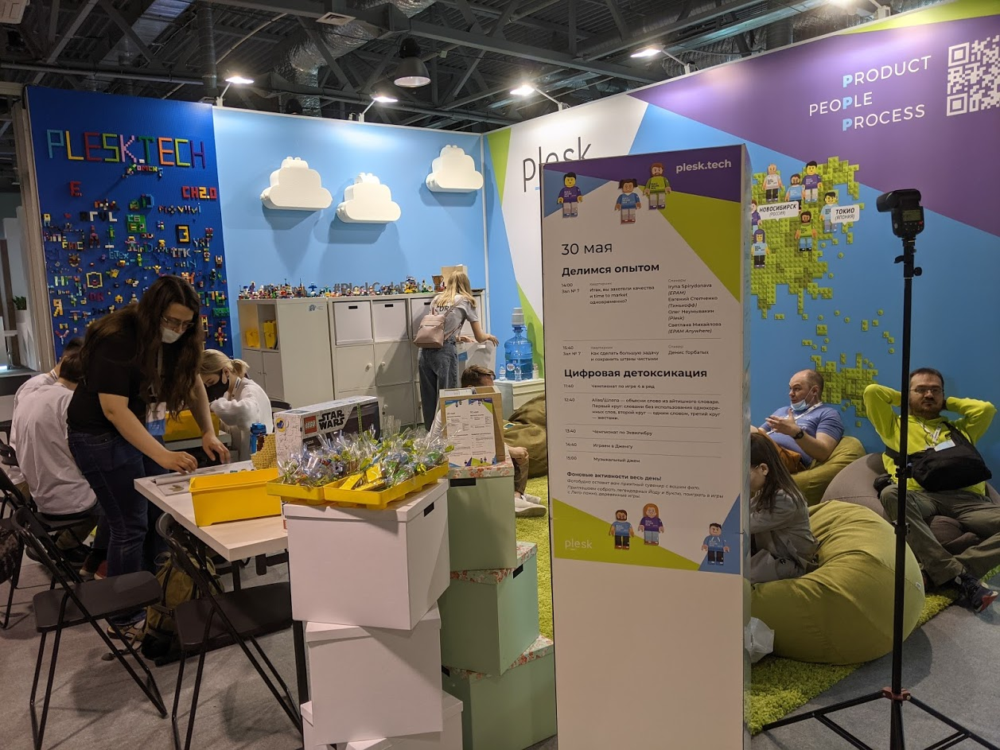
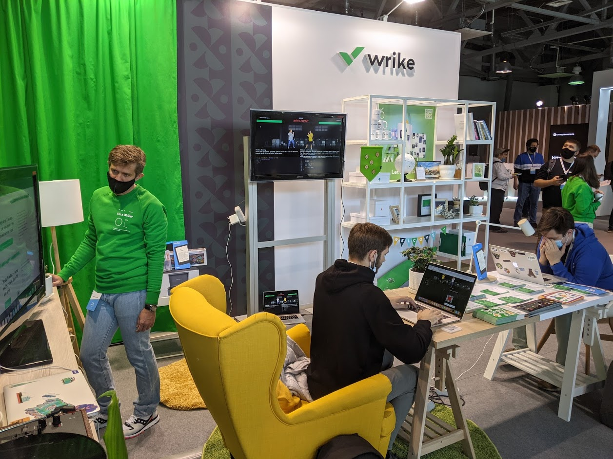

# ТЗ по застройке стенда

Размеры площадки для стенда 400 см в ширину и 200 см в глубину.

## Стандартное оборудование

По-умолчанию, мы ставим на стенд столы 80х200 см. высотой 80-90 см, электроточку (пилот на 5 розеток), скатерти для стола и стулья. На каждый стенд поставим зонт от солнца.

## Кастомное оборудование

Чаще всего для стенда помогают (это мы не предоставляем, но внизу есть список подрядчиков):

- телевизоры на стойке для интерактивности;
- ноутбуки для активностей и решения задач;
- Высокие стойки и столы для общения стоя;

## Стандартный задник

Мы готовим для всех стендов конструкцию для крепления задника:

Алиса для масштаба

Размеры конструкции:

- Высота общая — 258 см.;
- Ширина общая — 329 см.;
- Глубина общая — 258 см.;
- Ширина фермы — 29 см.;
- Размер под баннер без фермы — 300х200 см. + 200х200;

На конструкции можно закрепить следующие задники:

- Два виниловых баннера 300х200 + 200х200 на люверсах — фермы будут видны и стенд будет немного рок-н-ролльным и концертным, как у настоящих звёзд;
- Два виниловых  баннера 329х258 + 229х258 на люверсах — фермы будут скрыты за полотном баннера и видны только торцевые части. Стенд получится очень классическим;
- Сетчатый баннер 300х200 + 200х200 на люверсах, если хочется сделать задник исчезающим и полупрозрачным;
- OSB-плиты под размеры стенда — если хочется что-то вешать на задник, разрисовывать, украшать, делать трафарет, вырезать тантамареску или сделать стенд очень крафтовым. Не забывайте о креплении плиты к заднику, вам понадобится дрель для отверстий под стяжки;
- Цветные ленты, что подвесные цветы или что угодно на подвесах + растения в кадках — чтобы сделать красочных лёгкий стенд;

Крепление задника делается стяжками или веревками. Никакого скотча, пожалуйста. Рекомендуемое расстояние между люверсами — 50-70 см.

## Кастомный задник

Если у вас есть идея или конструкция, которая никак не совмещается с стандартным форматом и вы хотите сделать мегакрасочную штуку самостоятельно, пишите [Вадиму Мартынову](https://t.me/Vadimyan) — мы готовы идти на встречу компаниям с их идеями и согласуем стенд вместе.

Для кастомной застройки учитывайте высоту зонтов от солнца (200 см) и высокую парусность из-за открытой площадки. У подрядчиков (список внизу) можно будет заказать утяжелители.

## Наполнение стенда

Мы стандиртизируем только задник стенда чтобы компании могли сконцентрироваться на основном наполнении и активностях. Внутри площадки стенда вы можете выбрать любой формат:

- Стойка партнера с экспертами и мерчём компании

Highload++ 2021

- Барная стойка для неформального общения и тусовки

CodeFest 2021

- Фотозона для большого количества фотографий в соцсетях :)

CodeFest 2021

- Чиллаут для отдыха и развлечений

CodeFest 2021, обратите внимание на прекрасную лего-стену :)

- Любое оборудование для активностей и соревнований

## Ограничения для стенда

*Мы запрещаем на стенде использование звукоусиливающего оборудования и рекламу вакансий в материалах, в том числе на заднике стенда.* 

## Контрагенты для изготовления зданика и оборудования

Список КА, услугами которых мы пользуемся сами и которые будут готовить для площадки другое оборудование, поэтому с ними будет проще работать:

- Рекламно-производственная компания "ФАЗАН" [http://fazzan.pro/](http://fazzan.pro/) — печать, баннеры, конструкции, сувенирная продукция.
- Рекласное агенство Лиони [https://ralioni.ru/](https://ralioni.ru/) — печать, баннеры, конструкции, сувенирная продукция.
- Техноивент [https://technoevent.ru/](https://technoevent.ru/) — мебель, плазменные экраны, подиумы, утяжелители от ветра.
- Мы видели, что очень простой и красивый способ оборудовать стенд — это мебель ИКЕА [https://www.ikea.com/ru/ru/](https://www.ikea.com/ru/ru/), у них есть барые стулья и столы, красивые стеллажи, кресла и др.;
- На Авито много аренды кресел-мешков;

**← [К оглавлению](../README.md)**