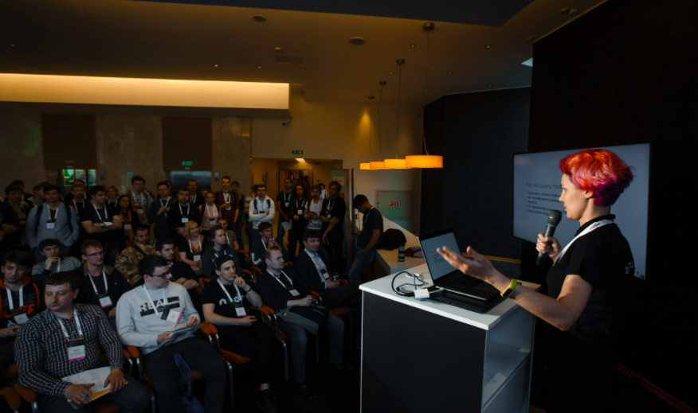
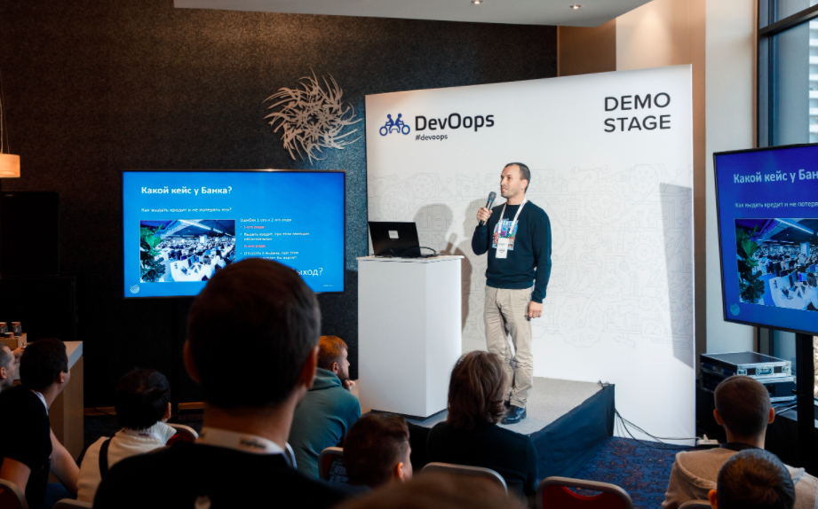

# Demo stage (Демо стейдж)

<aside>
📢 Демо стейдж - это небольшая по вместительности (30 мест) и расположенная в самом центре конференции сцена с презентационным оборудованием.

</aside>

В пакет Оффлайн-партнерства входит 20 мин доступа к демо-сцене (этот слот включает в себя подготовку сцены).

### Варианты выступлений на Demo Stage

**Небольшой технический доклад** 

Чтобы рассказать об актуальных проектах в компании с технической точки зрения

*(фотография стащена у конференции HolyJS)*

**Презентация о компании**

Чтобы рассказать о компании в целом, направлениях и проектах. Возможно заинтересует ваших HR и PR.

*(фотография стащена у конференции DevOops)*

**Приглашение на стенд**

Отличное место чтобы пригласить участников на стенд компании, рассказать об активностях и конкурсах

**Подведение итогов и розыгрыш призов**

Если компания проводит розыгрыш, викторину, квиз и любой другой конкурс, демо-стейдж это удобное место для объявления победителя и вручения приза: это попадёт в расписание демо-стейджа и все будут знать, куда и когда идти.

*(А это уже фоточка с нашей конфы)*

**← [К оглавлению](../README.md)**