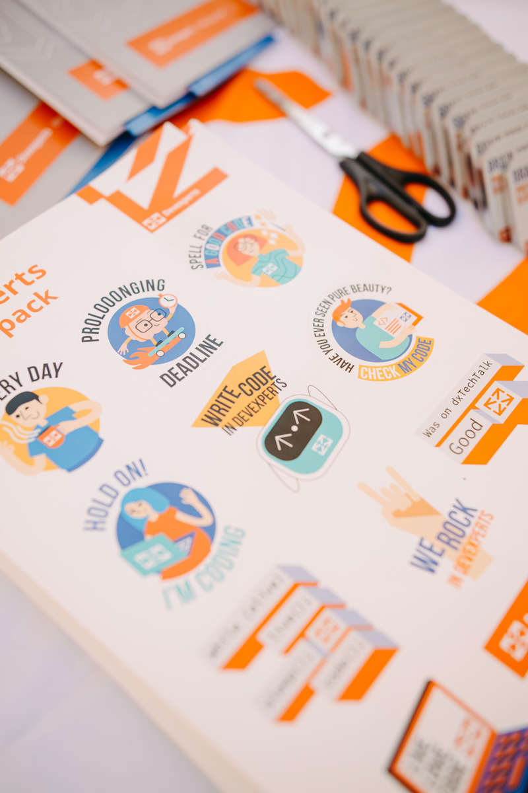
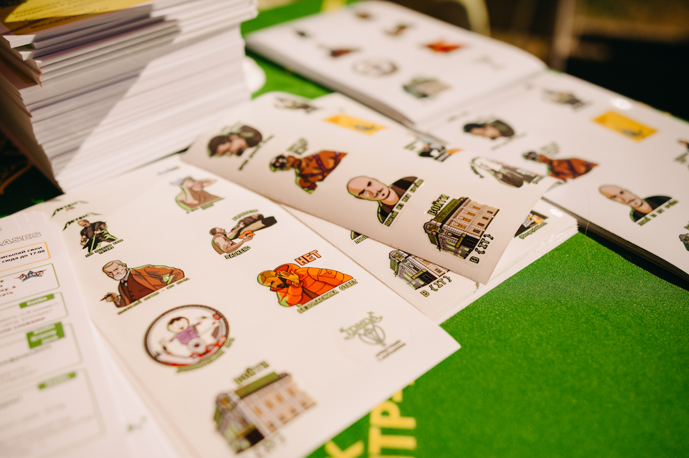
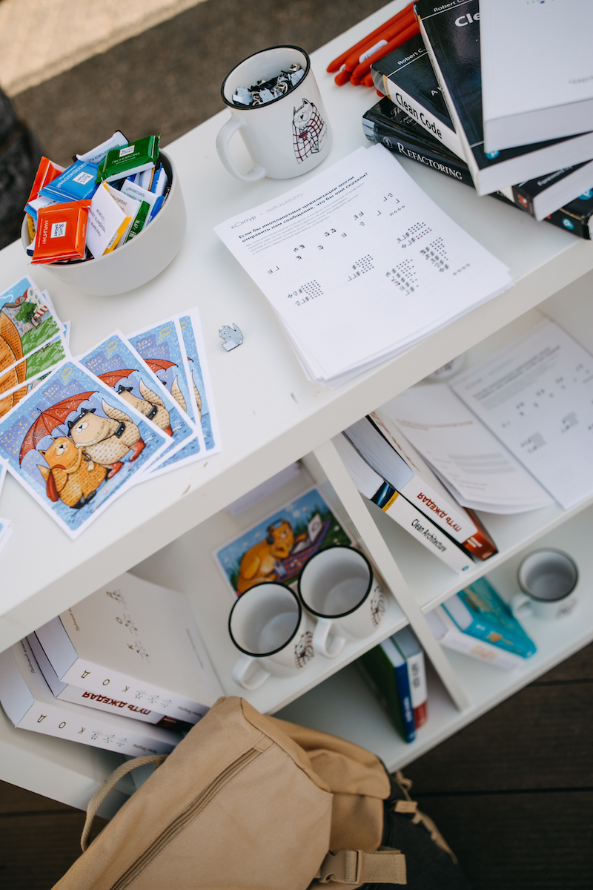
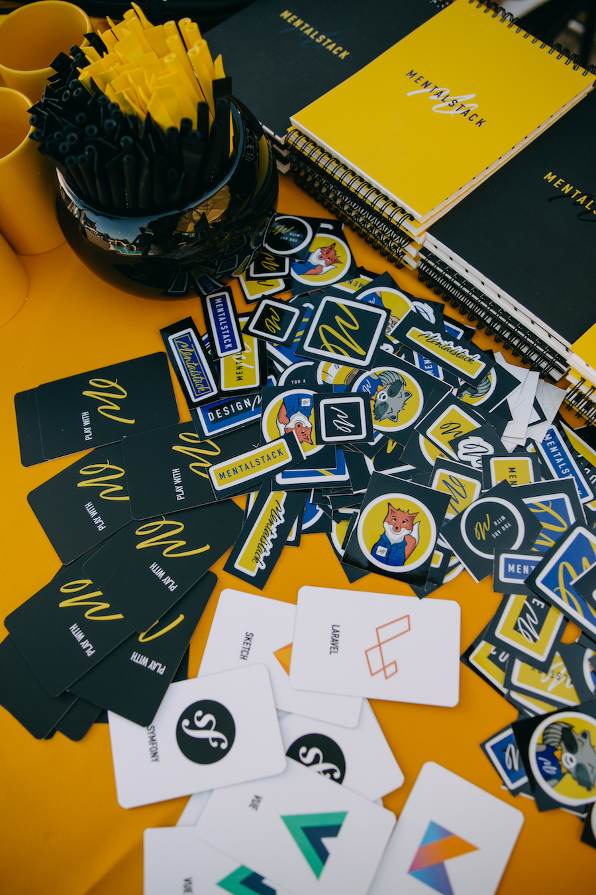
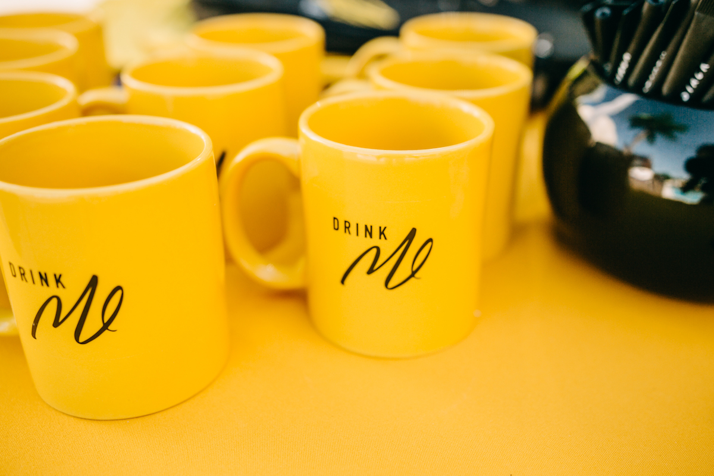

# Рекомендации по мерчу

## Раздатка в пакет участника

Каждый партнер конференции может разместить не более 1-й позиции в пакете участника. Например, 1 буклет или 1 стикерпак или 1 сувенир и т.п. Размер пакета 30х30 см. Это мало, но это значит, что больше участников придут на стенд пообщаться и узнать, что ещё у вас есть.

Мы очень не рекомендуем использовать флаеры и листовки в качестве материалов для пакета участника, их мало читают, много выбрасывают, а когда их много в пакете, они совсем не работают.

Примеры того, что обычно кладут в пакет участниа:

- Стикерпаки (все любят стикеры)
- Брелки, брелки-игры
- Браслет
- Мини-пятнашки
- Печенье с предсказанием
- Карамельки, сладкие и мятные конфетки, шоколадки
- Блокноты
- Ручки и карандаши
- Раскраска
- Набор цветных карандашей
- Носки

## Раздатка на стенде

В качестве раздаточных материалов: мягкие игрушки, слаймы, носки, стикерпаки (все любят стикеры), открытки, качественные ручки, карандаши, блокноты.

Примеры *с прошлых конференций:*

## Подарки

Рекомендуем практичные и полезные вещи в качестве подарков: 

Power-bank'и, наушники, книги, рюкзаки, бутылки для воды, кружки, термокружки.

Не забывайте про контекст мероприятия: лето, открытое площадка, бассейн. Будут популярны и хорошо видны прямо на конференции:

- головные уборы: кепки, панамки;
- "пляжные" принадлежности: сланцы, полотенца;
- холодные напитки и безалкогольные коктейли;
- предметы для бассейна: надувные круги, матрацы и т.д.;
- другие практичные штуки: термокружки, бутылочки для воды;

<aside>
📢 Важно! В качестве сувениров и подарков для участников мероприятия просим не использовать: алкогольную, табачную продукцию, а также предметы интимного характера.
</aside>

**← [К оглавлению](../README.md)**